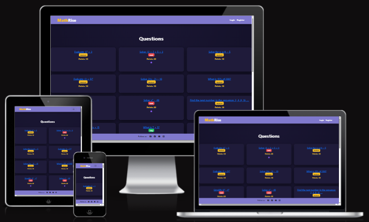

# Testing

Visit the deployed site here: [MathRise](https://mathrise-bd6d69167130.herokuapp.com/)

> [!NOTE]  
> Return back to the [README.md](README.md) file.

This document outlines the testing processes and results for the **MathRise** web application. It ensures that all features function as expected, meet accessibility standards, and provide an optimal user experience.

---

## CONTENTS

- [AUTOMATED TESTING](#automated-testing)
  - [Code Validation](#code-validation)
  - [HTML Validation Results](#html)
  - [CSS Validation Results](#css)
  - [JavaScript Validation Results](#javascript)
  - [Python Validation Results](#python)
  - [Lighthouse](#lighthouse)
- [MANUAL TESTING](#manual-testing)
  - [Full Testing](#full-testing)
  - [Browser Compatibility](#browser-compatibility)
  - [Responsiveness](#responsiveness)
  - [Defensive Programming](#defensive-programming)
  - [User Story Testing](#user-story-testing)
  - [Bugs](#bugs)

 

Testing was an **integral part of the development process**, ensuring the website remained both **functional and user-friendly** at every stage. By conducting **continuous testing**, potential issues were identified early, allowing for swift resolution and a more efficient workflow.

**Chrome Developer Tools** played a crucial role throughout development, providing real-time insights into performance, responsiveness, and debugging. This proactive approach helped streamline development and ensure the final product adhered to high-quality standards.

Additionally, **ChatGPT** served as a key resource for refining ideas, optimizing content, and overcoming technical challenges. By offering structured guidance, best practices, and alternative solutions, it contributed to improving both the efficiency of development and the overall quality of the final product.

To guarantee **cross-device compatibility**, every screen was rigorously tested across various **screen sizes and devices** using Chrome Developer Tools. This process ensured that Echoes of Light was fully responsive, providing a seamless user experience across **desktops, tablets, and mobile devices**.

---

## AUTOMATED TESTING

A series of **automated testing** tools were used on the site to check the code for web standard compliance and errors. These tools ensured repeatable, scalable, and performance-driven results throughout the site’s development.

---

## Code Validation

### HTML

I have used the recommended [HTML W3C Validator](https://validator.w3.org) to validate all of my HTML files.

| Page | Screenshot | Notes |
| --- | --- | --- |
| Home |  | Pass: No Errors. |
| Profile |  | Pass: No Errors. |
| Dashboard | | Pass: No Errors |
| Sign In | | Pass: No Errors |
| Sign Up |  | Pass: No Errors |
| Sign Out |    | Pass: No Errors |

---

### CSS

I have used the recommended [CSS Jigsaw Validator](https://jigsaw.w3.org/css-validator) to validate all of my CSS files. Which passed with no errors.

---

### JavaScript

I have used the recommended [JShint Validator](https://jshint.com) to validate all of my JS files.

| File | Screenshot | Notes |
| --- | --- | --- |
| question_modal.js | | Pass: No Errors  |

---

### Python

I have used the recommended [PEP8 CI Python Linter](https://pep8ci.herokuapp.com) to validate all of my Python files.

#### Validation For MathRise Project
| File | Screenshot | Notes |
| --- | --- | --- |
| asgi.py |  | Pass: No Errors |
| settings.py |  | Pass: No Errors |
| urls.py |  | Pass: No Errors |
| wsgi.py |  | Pass: No Errors |

#### Validation For User App
| File | Screenshot | Notes |
| --- | --- | --- |
| adapters.py |  | Pass: No Errors |
| admin.py | | Pass: No Errors |
| apps.py | | Pass: No Errors |
| forms.py | | Pass: No Errors |
| models.py |  | Pass: No Errors |
| urls.py | | Pass: No Errors |
| utils.py | | Pass: No Errors |
| views.py | | Pass: No Errors |

#### Validation For Payment App
| File | Screenshot | Notes |
| --- | --- | --- |
| admin.py |  | Pass: No Errors |
| apps.py | | Pass: No Errors |
| forms.py |  | Pass: No Errors |
| models.py |  | Pass: No Errors |
| urls.py | | Pass: No Errors |
| views.py |  | Pass: No Errors |

#### Validation For Quiz App
| File | Screenshot | Notes |
| --- | --- | --- |
| admin.py | | Pass: No Errors |
| apps.py | | Pass: No Errors |
| forms.py |  | Pass: No Errors |
| models.py | | Pass: No Errors |
| urls.py |  | Pass: No Errors |
| views.py | | Pass: No Errors |

---

## Lighthouse Audit

I've tested my deployed project using the Lighthouse Audit tool to check for any major issues, the tool tests the websites Performance, Accessibility, Best Practices and SEO(Search Engine Optimization). Thankfully no major issues were found and all pages achieved great scores across both mobile and desktop.

### MathRise App - Mobile Testing
| Page | Size | Screenshot | 
| --- | --- | --- | 
| Home | Mobile |  | 
| Sign In | Mobile | |
| Sign Up | Mobile | |
| Sign Out | Mobile | |
| Dashboard | Mobile |  | 
| Profile | Mobile | | 

### MathRise - Desktop Testing
| Page | Size | Screenshot | 
| --- | --- | --- | 
| Home | Desktop |  | 
| Sign In | Desktop |  |
| Sign Up | Desktop |  |
| Sign Out | Desktop |  |
| Dashboard | Desktop | | 
| Profile | Desktop | | 

---

## Manual Testing

### Full Testing

This section outlines the **manual testing** process conducted to ensure the website functions correctly across different devices, screen sizes, and user interactions. Each test was performed methodically to identify potential issues with responsiveness, usability, and accessibility, with results documented for further improvements. Additional testing was carried out by friends and family on a variety of devices and screen sizes.

---

## Browser Compatibility

I've tested my deployed project on multiple browsers to check for compatibility issues.

| Browser | Screenshot | Notes |
| --- | --- | --- |
| Chrome |  | Works as expected |
| Firefox |    | Works as expected |
| Edge |    | Works as expected |
| Opera |    | Works as expected |

---

## Responsiveness

In addition to testing my deployed site on different devices, I thoroughly tested its responsiveness using Chrome Developer Tools.
I researched the narrowest width of modern devices on Stack Exchange and based my testing on 320px as a standard minimum width.
Additionally, I used the Mobile First Plugin, a Chrome extension designed to test site responsiveness across different devices.

---

### Home Screen

#### Mobiles
| Device | Screen Width(px) | Screen Height (px)|
| --- | --- | --- |
| iPhone 5     | 320 | 568 |
| iPhone 13     | 390 | 844 |
| Samsung S20     | 360 | 800 |
| OnePlus Nord 2    | 412 | 915 |

#### Tablets
| Device | Screen Width(px) | Screen Height (px)|
| --- | --- | --- |
| iPad Mini     | 768 | 1024 |
| Galaxy Tab S7     | 800 | 1280 |
| iPad Pro 11    | 834 | 1194 |

#### Laptops and Desktops
| Device | Screen Width(px) | Screen Height (px)|
| --- | --- | --- |
| MacBook Air 13'     | 1280 | 800 |
| Dell Latitude     | 1440 | 809 |
| iMac 24'      | 2048 | 1142 |

---

### Login Screen

#### Mobiles
| Device | Screen Width(px) | Screen Height (px)|
| --- | --- | --- |
| iPhone 5     | 320 | 568 |
| iPhone 13    | 390 | 844 |
| Samsung S20    | 360 | 800 |
| OnePlus Nord 2    | 412 | 915 |

#### Tablets
| Device | Screen Width(px) | Screen Height (px)|
| --- | --- | --- |
| iPad Mini    | 768 | 1024 |
| Galaxy Tab S7    | 800 | 1280 |
| iPad Pro 11    | 834 | 1194 |

#### Laptops and Desktops
| Device | Screen Width(px) | Screen Height (px)|
| --- | --- | --- |
| MacBook Air 13'    | 1280 | 800 |
| Dell Latitude    | 1440 | 809 |
| iMac 24'     | 2048 | 1142 |

---

### Logout Screen

#### Mobiles
| Device | Screen Width(px) | Screen Height (px)|
| --- | --- | --- |
| iPhone 5    | 320 | 568 |
| iPhone 13     | 390 | 844 |
| Samsung S20     | 360 | 800 |
| OnePlus Nord 2     | 412 | 915 |

#### Tablets
| Device | Screen Width(px) | Screen Height (px)|
| --- | --- | --- |
| iPad Mini    | 768 | 1024 |
| Galaxy Tab S7     | 800 | 1280 |
| iPad Pro 11     | 834 | 1194 |

#### Laptops and Desktops
| Device | Screen Width(px) | Screen Height (px)|
| --- | --- | --- |
| MacBook Air 13'     | 1280 | 800 |
| Dell Latitude     | 1440 | 809 |
| iMac 24'      | 2048 | 1142 |

---

### SignUp Screen

#### Mobiles
| Device | Screen Width(px) | Screen Height (px)|
| --- | --- | --- |
| iPhone 5    | 320 | 568 |
| iPhone 13     | 390 | 844 |
| Samsung S20     | 360 | 800 |
| OnePlus Nord 2     | 412 | 915 |

#### Tablets
| Device | Screen Width(px) | Screen Height (px)|
| --- | --- | --- |
| iPad Mini    | 768 | 1024 |
| Galaxy Tab S7    | 800 | 1280 |
| iPad Pro 11     | 834 | 1194 |

#### Laptops and Desktops
| Device | Screen Width(px) | Screen Height (px)|
| --- | --- | --- |
| MacBook Air 13'    | 1280 | 800 |
| Dell Latitude     | 1440 | 809 |
| iMac 24'     | 2048 | 1142 |

---

### Dashboard

#### Mobiles
| Device | Screen Width(px) | Screen Height (px)|
| --- | --- | --- |
| iPhone 5    | 320 | 568 |
| iPhone 13     | 390 | 844 |
| Samsung S20    | 360 | 800 |
| OnePlus Nord 2     | 412 | 915 |

#### Tablets
| Device | Screen Width(px) | Screen Height (px)|
| --- | --- | --- |
| iPad Mini     | 768 | 1024 |
| Galaxy Tab S7     | 800 | 1280 |
| iPad Pro 11     | 834 | 1194 |

#### Laptops and Desktops
| Device | Screen Width(px) | Screen Height (px)|
| --- | --- | --- |
| MacBook Air 13'     | 1280 | 800 |
| Dell Latitude     | 1440 | 809 |
| iMac 24'   img src="">   | 2048 | 1142 |

---

### Profile

#### Mobiles
| Device | Screen Width(px) | Screen Height (px)|
| --- | --- | --- |
| iPhone 5     | 320 | 568 |
| iPhone 13     | 390 | 844 |
| Samsung S20     | 360 | 800 |
| OnePlus Nord 2    | 412 | 915 |

#### Tablets
| Device | Screen Width(px) | Screen Height (px)|
| --- | --- | --- |
| iPad Mini     | 768 | 1024 |
| Galaxy Tab S7     | 800 | 1280 |
| iPad Pro 11     | 834 | 1194 |

#### Laptops and Desktops
| Device | Screen Width(px) | Screen Height (px)|
| --- | --- | --- |
| MacBook Air 13'     | 1280 | 800 |
| Dell Latitude    | 1440 | 809 |
| iMac 24'     | 2048 | 1142 |

---

## Defensive Programming

Defensive programming was manually tested with the below user acceptance testing:

| Page | User Action | Expected Result | Pass/Fail | Screen Clip |
| --- | --- | --- | --- | --- |
| Nav links | | | | |

| Home page | | | | |

| Dashboard  | | | | |

| Profile | | | | |

| Question Modal | | | | |

| Login Page | | | | |
| | Enter valid Username | Field will only accept registered users | Pass | |
| | Enter valid password | Field will only accept password format | Pass |  |
| | Click on Sign In button | Redirects user to Dashboard | Pass | |
| | Click on Sign Up link | Redirects user to Sign Up page | Pass | |

| Sign Up Page | | | | |

| Log Out Page | | | | |
| | Click Sign Out button | Logs out user, Redirects user to Home page | Pass |  |

---

## User Story Testing

---

## Bugs

No major bugs were identified during testing.